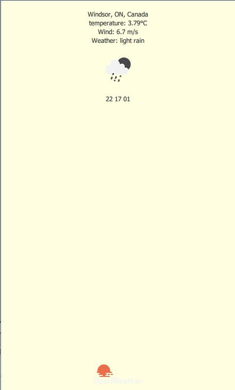
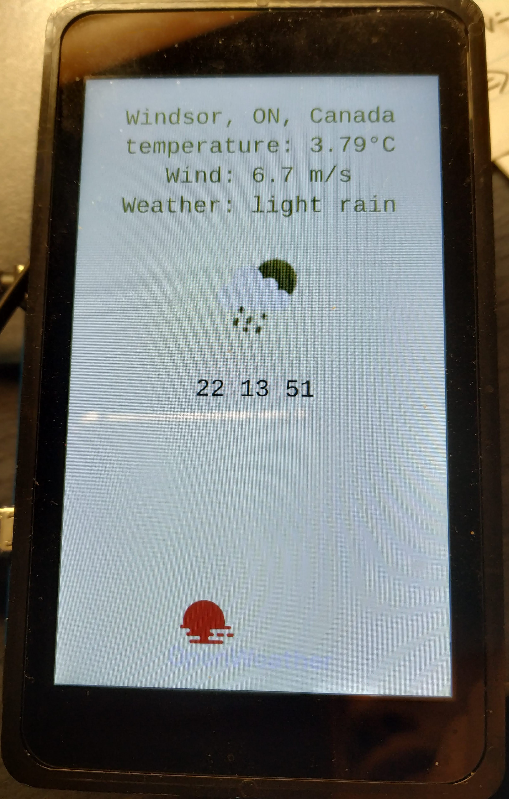

# Weather_Station_QT
This is a QT weather station project, you can see location, temperature, wind, and weather on the screen, also you will hear the background music. I used Yocto to create a Qt-Linux image. As you know QT is cross-platform framework, so I can make it run both on computer and the board. For this project, I used QML to do the layout and interface, and using json to parse the information.

## Picture of project

    
     
    
running on computer

    
     
    
running on STM32MP157C-DK2 

